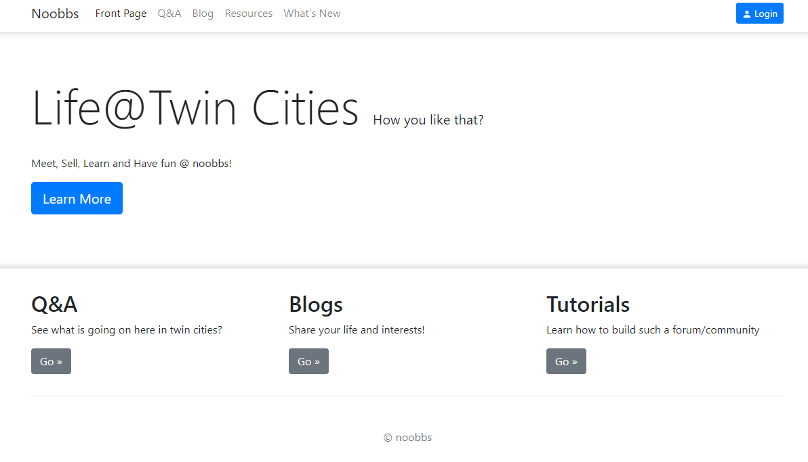

# Noobbs



### Introduction

> An open source bbs modified from kuangbbs

> will be deployed soon!

Major Dependencies:
- SpringBoot 2.3.0
- MySQL 5.7
- MyBatisPlus 3.0.5
- swagger
- fastjson
- thymeleaf
- editormd
- layer
- bootstrap
- springsecurity
- code-generator

### Tutorial

1.  build databases with the sql file
2.  change user invitation settings
3.  test
4.  do whatever you want

### Content and Structures
```shell script
src/main/java/com/kuang
- config        configurations
- controller    MVC controllers
- generator     code-generator
- mapper        mapper: mybatis
- pojo          pojo
- result        returning data
- service       service
- utils         
- vo            vo objects
KuangstudyApplication   start the application!

src/resources
- static        
- templates     
- application-dev.properties   

kuangshen.sql   
```
